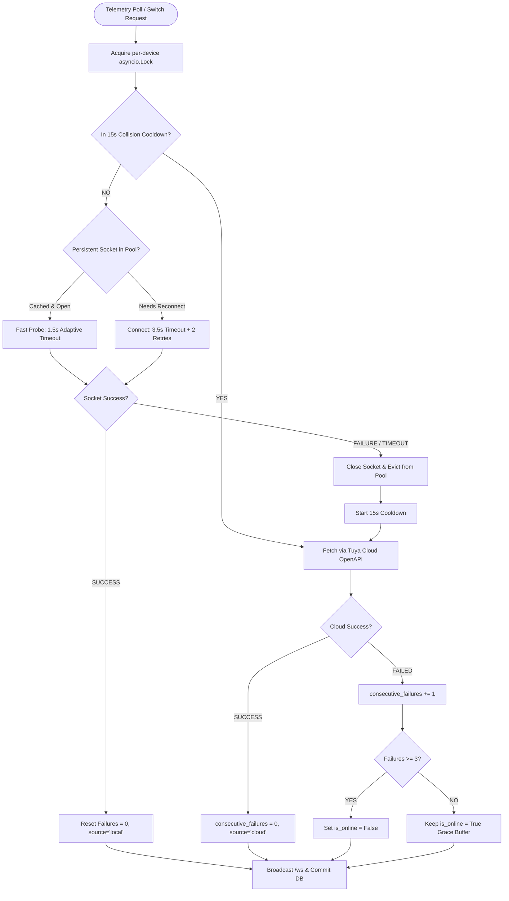

# Smart Plug Telemetry & Remote Control Guide

This document explains the hardware integration, high-speed telemetry polling, real-time WebSocket streaming, remote switching, 4-hour historical power analytics, and the visual threshold calibration studio in **WashQueue**.

---

## 1. Supported Hardware & Protocols

* **Hardware**: Wipro / Tuya 16A Smart Plugs (and multi-socket power strips).
* **Local LAN Protocol**: Direct AES-encrypted TCP socket communication over port `6668` using `tinytuya` (v3.3 / v3.4).
* **Cloud API Protocol**: Tuya Cloud OpenAPI (`iot-03/devices/{device_id}/commands`) with Apache Pulsar MQ integration.

---

## 2. High-Speed Telemetry & Real-Time WebSockets

```
[Smart Plug] ──(1s Local TCP Socket)──> [Backend Server] ──(WebSocket Push < 10ms)──> [Dashboards]
                                              │
                                              └──(Cloud Fallback if Isolated)──> [Tuya Cloud]
```

* **2-Second Polling Loop**: The background telemetry worker runs every **2 seconds** (`TELEMETRY_POLL_INTERVAL=2` in `backend/.env`). This matches the hardware refresh rate of the BL0937/HLW8012 power measurement IC and avoids FreeRTOS/lwIP heap exhaustion or watchdog timer resets. Direct local socket queries execute in **~15ms–20ms** with zero cloud quota usage and tag `source="local"`.
* **Sub-10ms WebSocket Broadcast**: Whenever a telemetry reading is recorded, the backend broadcasts a `telemetry_update` message over the open WebSocket connection (`/ws`). Connected browser dashboards update immediately without HTTP polling overhead.
* **Automatic Cloud Fallback**: If the hostel Wi-Fi router has AP/Client Isolation enabled or the local port is occupied by another client, the provider automatically falls back to Tuya Cloud API and tags `source="cloud"`.

---

## 3. Socket Churn, Concurrency Collisions & Timeout Sensitivity Engine

### A. The "Device Unreachable on Same Wi-Fi" Paradox (Hardware Root Causes)
Hostel laundry environments frequently encounter situations where a smart plug is confirmed to be on the exact same Wi-Fi network as the server, yet queries return `Device unreachable` or connection timeouts. Investigation revealed five hardware, operating system, and protocol constraints:

1. **Tuya Single TCP Connection Limitation**:
   Tuya/Wipro plugs run lightweight microcontrollers (ESP8266, Beken BK7231T/N, or Realtek RTL8710) with a minimal TCP/IP stack (LwIP). Firmware strictly allows **only ONE active TCP connection on port `6668`** at a time. If the official **Smart Life**, **Tuya**, or **Wipro** app is open on any smartphone on the Wi-Fi, the app establishes a direct local LAN connection, rejecting or dropping all incoming TCP `SYN` packets from the PC.
2. **Microcontroller Socket Churn & `TIME_WAIT` Starvation**:
   Polling every 1 second by creating and destroying ephemeral socket objects forces a continuous cycle of TCP handshakes (`SYN`, `SYN-ACK`, `ACK`), DP query exchanges, and socket closures (`FIN`/`RST`). Microcontrollers maintain a tiny pool of TCP Control Blocks (TCBs). Lingering sockets in `TIME_WAIT` state exhaust this pool, causing the chip to drop connections intermittently for 15–30 seconds until the OS reclaims memory.
3. **802.11 DTIM Sleep Mode vs. Static Timeouts**:
   To maintain sub-0.5W standby consumption, Tuya chips enter 802.11 DTIM light sleep. When waking up to respond to an incoming query, they may take 1.5–2.5 seconds to acknowledge. A static 2.0s timeout prematurely reports the device offline on minor Wi-Fi jitter.
4. **Windows Multi-NIC & Virtual Adapter Route Metric Overrides**:
   On Windows developer and server systems with **Tailscale** (`100.127.x.x`), **WSL Hyper-V** (`192.168.144.1`), or **VirtualBox** (`192.168.56.1`), the Windows socket layer frequently assigns route metrics that misdirect outbound packets away from the physical Wi-Fi NIC (`192.168.1.12`).
5. **DHCP Dynamic IP Drift**:
   When routers reboot or DHCP leases expire, plugs without static IP reservations are reassigned new IP addresses (e.g. from `.15` to `.18`), rendering hardcoded `.env` entries unreachable.

---

### B. Architectural Decision Making & Trade-Off Analysis

During our technical design sessions, we evaluated multiple candidate architectures and made explicit design decisions to resolve these constraints:



#### Decision 1: Persistent Connection Pooling vs. Ephemeral Sockets
* **Problem**: Re-creating `tinytuya.OutletDevice` every second causes rapid socket churn, TCP handshake overhead (~60ms), and microcontroller socket exhaustion.
* **Decision**: Maintain a module-level persistent device cache (`_device_pool: Dict[str, BoundOutletDevice]`) configured with `device.set_socketPersistent(True)` and `device.set_socketNODELAY(True)`.
* **Trade-Off**: Holding a persistent socket reduces telemetry round-trip latency to **~15ms** and prevents socket exhaustion. However, it requires proactive teardown (`_check_socket_close(True)`) and cache eviction whenever device parameters change or socket errors occur.

#### Decision 2: Adaptive Timeout Sensitivity (1.5s Probe $\rightarrow$ 3.5s Reconnect)
* **Problem**: A fixed short timeout (e.g. 2s) fails during device sleep wake-up, while a fixed long timeout (e.g. 4s) blocks asynchronous polling workers when a device is genuinely disconnected.
* **Decision**: Implement dynamic two-stage timeouts:
  * **1.5-second fast probe**: Applied on already-open persistent sockets where the TCP connection is established.
  * **3.5-second reconnect expansion**: Applied when opening a new socket or recovering from a dropped connection, paired with `set_socketRetryLimit(2)` and `set_socketRetryDelay(0.2s)`.
* **Trade-Off**: Balances instantaneous response times during steady-state polling with maximum tolerance for Wi-Fi jitter during reconnection.

#### Decision 3: 3-Miss Grace Buffer for Online/Offline UI State
* **Problem**: Marking a plug offline on a single missed packet caused the Admin UI and live gauges to rapidly flicker between emerald (`ONLINE`) and crimson (`OFFLINE`).
* **Decision**: Require **3 consecutive failed polling ticks** (`consecutive_failures >= 3`) before transitioning `plug.is_online = False` in `washqueue.db` and broadcasting offline over WebSockets. A single successful reading immediately resets `consecutive_failures = 0` and confirms online status.
* **Trade-Off**: Transient 1–2 missed packets (e.g. during heavy microwave interference or brief sleep delays) are smoothly absorbed without alarming operators, while true power disconnections or unplugs are reliably flagged within 3–9 seconds.

#### Decision 4: Fixed 15-Second Collision Cooldown with Cloud Fallback
* **Problem**: When a resident opens the Tuya/Smart Life mobile app on the hostel Wi-Fi, the plug refuses local connections. Bombarding the plug with retries every second wastes CPU cycles and generates hundreds of connection refused logs.
* **Decision**: When a local query fails due to conflict, register a **15-second cooldown** (`_collision_cooldown[device_id] = now + 15.0`). During cooldown, all telemetry and switch commands route immediately to the Tuya Cloud OpenAPI fallback. Once the cooldown expires, the engine performs a single quiet local probe to re-establish the fast local connection.
* **Trade-Off**: Avoids port hammering, allows the mobile app session to complete smoothly, and maintains uninterrupted telemetry without data holes.

#### Decision 5: Per-Device Concurrency Serialization (`asyncio.Lock`)
* **Problem**: The background polling loop (`poll_all_smart_plugs`) and user-initiated actions (e.g. clicking the switch toggle `/api/smart-plugs/{id}/switch` or triggering a test cycle) run concurrently in FastAPI's asyncio event loop. Two tasks sending packets over port 6668 simultaneously cause packet interleaving, `DecodeError`, or `ERR_CONNECT`.
* **Decision**: Implement an `asyncio.Lock` per device ID (`get_device_lock(device_id)`). Every operation targeting a physical plug acquires this lock before dispatching to the executor thread.
* **Trade-Off**: Serializes operations with sub-millisecond queuing delay, completely eliminating intra-process race conditions.

#### Decision 6: Clean Socket Subclassing (`BoundOutletDevice`) vs. Global Monkey-Patching
* **Problem**: To bypass Windows VPN route capture, a previous workaround monkey-patched Python's global `socket.socket = wrapped_socket`. In a multi-threaded async environment, this caused race conditions across database connections, HTTP requests, and Tuya cloud calls.
* **Decision**: Subclass `tinytuya.OutletDevice` into `BoundOutletDevice` overriding `_get_socket(renew)`. The method creates a standard `socket.socket`, binds only that instance to the physical Wi-Fi interface IP (`192.168.1.12`), and sets `TCP_NODELAY` without ever touching Python's global `socket` module.
* **Trade-Off**: 100% clean isolation with zero side-effects on other libraries or threads.

#### Decision 7: Smart Dual-Mode CLI Coordination (`read_plug.py` & `record_telemetry.py`)
* **Problem**: Developers or operators running CLI tools while the FastAPI backend was running caused immediate port 6668 collisions between the terminal and the backend.
* **Decision**: Built smart dual-mode into both CLI utilities:
  * Probes `http://127.0.0.1:8000/api/smart-plugs`.
  * If the backend is running, the CLI streams live telemetry from the backend's REST/WebSocket endpoints with zero port 6668 contention.
  * If the backend is stopped, the CLI connects directly via `TuyaLocalProvider` using persistent pooling.
* **Trade-Off**: Eliminates operator error and guarantees zero port contention during maintenance or data recording.

---

## 4. 4-Hour Historical Power Graph (Local vs. Cloud Differentiable)

WashQueue stores and aggregates historical telemetry to graph power signatures over a rolling 4-hour window.

### Endpoint
```http
GET /api/smart-plugs/{id}/history?hours=4
Headers:
  X-Admin-PIN: 1234
```

### Response Schema
```json
{
  "plug_id": "0df62734-ad1a-4eb3-81b4-2396120800b4",
  "plug_name": "SpeedQueen Washer 02 Plug",
  "hours": 4,
  "peak_power_w": 1159.4,
  "avg_power_w": 284.2,
  "local_points_count": 232,
  "cloud_points_count": 12,
  "series": [
    {
      "timestamp": "2026-09-01T20:10:00Z",
      "power_w": 340.5,
      "voltage_v": 232.1,
      "current_ma": 1460.0,
      "source": "local"
    }
  ]
}
```

### Visualizer Presentation
* **🟢 Local LAN / WebSocket (`#10b981`)**: Smooth solid emerald gradient curve for ~1-second high-density local telemetry.
* **🔷 Tuya Cloud Fallback (`#06b6d4`, `◆`)**: Cyan diamond point markers and dashed connector lines.
* **Live Dynamic Append**: Active open chart modals dynamically append incoming real-time WebSocket telemetry packets.

---

## 5. Visual Threshold Calibration Studio (Web UI)

To allow non-technical hostel wardens and administrative staff to tune power thresholds without raw code or electrical engineering knowledge, WashQueue provides an **Interactive Graph & WebSocket Threshold Calibration Studio** directly in the Admin Panel (`/admin` -> **IoT & Smart Plugs** -> **Visual Calibration Studio**):

### 1-Click Appliance Profile Presets
* 🌀 **Top-Load (Deep Soak)**: Running Cutoff: `12.0W`, Soak/Pause Cutoff: `4.0W`, Debounce Soak: `240s` (4-min buffer prevents false completion alerts during long agitation pauses).
* 🌊 **Front-Load Inverter DD**: Running Cutoff: `8.0W`, Soak/Pause Cutoff: `3.5W`, Debounce Soak: `90s` (optimized for smooth sinusoidal tumbling direct-drive motors).
* 🔥 **Front-Load Heated (Steam)**: Running Cutoff: `10.0W`, Soak/Pause Cutoff: `4.0W`, Debounce Soak: `120s` (handles high-power internal water heater plates up to 2200W).
* ⚡ **Compact / Quick Wash**: Running Cutoff: `6.0W`, Soak/Pause Cutoff: `2.5W`, Debounce Soak: `60s` (low-draw mini washers & short 15-min cycles).
* 💨 **Commercial Drum Dryer**: Running Cutoff: `25.0W`, Soak/Pause Cutoff: `10.0W`, Debounce Soak: `60s` (high-power continuous tumbling commercial dryers).
* 🛠️ **Custom Tuning**: Fine-tune via sliders or direct on-chart drag handles.

### Interactive SVG Chart & Smart Features
* **⚡ Auto-Detect from Graph**: Scans the loaded 4-hour telemetry curve, measures baseline standby wattage, detects the longest soak pause, snaps the sliders to the optimal values, and displays the detected machine archetype badge!
* **🧪 Simulate Test Cycle**: Injects a synthetic 25-minute wash cycle into the database in 1 click, instantly populating the graph for testing without running physical appliances.
* **🟢 Active Wash Zone (Emerald Background)**: $[ \text{Running Cutoff}, \text{Max Power} ]$ $\rightarrow$ Status: `in_use`.
* **🟡 Soak / Pause Zone (Amber Background)**: $[ \text{Idle Cutoff}, \text{Running Cutoff} ]$ $\rightarrow$ Status: `soak` (starts debounce timer).
* **⚪ Standby / Empty Zone (Dark Background)**: $[ 0, \text{Idle Cutoff} ]$ $\rightarrow$ Status: `available`.
* **Draggable Guide Lines**: Admins can drag horizontal dotted threshold lines (Green `RUN` and Amber `SOAK`) up or down directly on the live power curve.
* **Hostel-Wide Propagation**: Checkbox *"Apply this calibration to all similar machines in this hostel"* batch-updates similar washers across the building.

### Calibration Endpoints
```http
PATCH /api/smart-plugs/{id}/calibration
Headers:
  X-Admin-PIN: 1234
Content-Type: application/json

{
  "power_threshold_running": 12.0,
  "power_threshold_idle": 4.0,
  "debounce_seconds": 180,
  "apply_to_similar_machines": true
}
```

```http
POST /api/smart-plugs/{id}/auto-calibrate?apply=false
Headers:
  X-Admin-PIN: 1234
```

```http
POST /api/smart-plugs/{id}/simulate-cycle?minutes=25
Headers:
  X-Admin-PIN: 1234
```

---

## 6. Washing Machine Power Profiles & Archetypes

Different washing machine mechanisms produce vastly different electrical power signatures. Understanding these archetypes is critical for accurate inference:

| Machine Archetype | Example Models | Power Curve Characteristics | Key Gotcha & Tuning Rule |
| :--- | :--- | :--- | :--- |
| **Top-Load Pulsator** | IFB, Samsung, Whirlpool Top-Loads | Sharp, high-frequency pulses (180W–320W bursts every 2s) as agitator oscillates. | **Deep soak pauses (3–10 minutes at 0–2W)**. `debounce_seconds` must be set to **180s–300s** so soak pauses aren't mistaken for cycle completion. |
| **Front-Load Inverter DD** | LG AI DirectDrive, Bosch Serie 6 | Smooth sinusoidal power ramp (100W–250W); gentle drum reversals; spin cycle ramps to 450W–650W. | Shorter rest intervals (20s–60s). `debounce_seconds` of **90s–120s** is ideal. |
| **Front-Load with Heater** | Any washer running Hot/Steam wash | Wash agitation interrupted by a **sustained 1800W–2200W plateau** for 15–25 minutes. | High peak power; standard pauses. Set `running` at **10W**, `debounce` at **120s**. |
| **Commercial / Laundromat** | Speed Queen, Maytag Commercial | Continuous motor hum, fast mechanical timer, violent drainage/spin. | Minimal pauses (<45s). Lower debounce (**60s–90s**) allows faster machine turnover. |

---

## 7. Telemetry Logging, Simulation & Tuning Suite (CLI)

For developers and power users, WashQueue provides dedicated command-line utilities in `backend/scripts/`:

### A. Live Cycle Recorder & Auto-Tuner (`record_telemetry.py`)
```powershell
python scripts/record_telemetry.py --machine "Washer 1" --interval 1.0
```
* Polls local LAN socket every 1s (<20ms latency).
* Features **smart dual-mode**: automatically routes through the active FastAPI backend API if running to prevent port 6668 collision, or connects directly if standalone.
* Streams real-time console dashboard (Timestamp, Watts, Volts, Current, Inferred State).
* Simultaneously writes high-res data to `telemetry_logs/telemetry_washer_1_<timestamp>.csv` and `washqueue.db`.
* On <kbd>Ctrl</kbd>+<kbd>C</kbd>, generates full cycle report (peak spin power, baseline standby, longest soak pause) and auto-updates the plug's thresholds in the database.

### B. Synthetic Cycle Simulator (`scripts/diagnostics/simulate_wash_cycle.py`)
```powershell
python scripts/diagnostics/simulate_wash_cycle.py --minutes 30
```
* Generates a complete physics-based washing machine power profile (fill, agitation, soak pause, rinse, spin, standby) into `washqueue.db` and CSV in ~5 seconds.
* Useful for offline algorithm testing when physical appliances are not running. Tests candidate thresholds against synthetic data and flags premature soak triggers.

### C. Offline CSV Benchmark Tuner (`tune_from_csv.py`)
```powershell
python scripts/tune_from_csv.py --csv telemetry_logs/my_cycle.csv --debounce 180
```
* Replays any past recorded wash run from CSV without running physical appliances.
* Evaluates state machine transitions and verifies zero false-positive completions.

### D. Historical Telemetry Exporter (`export_telemetry.py`)
```powershell
python scripts/export_telemetry.py --device-id d7fa4d27a2883bb4feqvhl --hours 24 --format csv
```
* Dumps stored time-series readings from SQLite (`washqueue.db`) to CSV or JSON.

### E. Live Plug Diagnostic Inspector (`scripts/diagnostics/read_plug.py`)
```powershell
python scripts/diagnostics/read_plug.py
```
* Instant snapshot inspector for live smart plug voltage, wattage, and current.
* Features **smart dual-mode**: queries active backend API if running, or direct socket if backend is stopped.

### F. Maintenance & Recovery (`scripts/maintenance/`)
```powershell
python scripts/maintenance/repair_db.py
python scripts/maintenance/clean_reset_db.py
```
* **`repair_db.py`**: Emergency repair utility to rescue records from corrupted SQLite databases and enable WAL mode.
* **`clean_reset_db.py`**: Wipes transient bookings/telemetry and resets machines to clean baseline.

---

## 8. Database Persistence & Network Architecture

### SQLite WAL Mode (Write-Ahead Logging)
* `backend/washqueue.db` operates in **WAL mode** (`PRAGMA journal_mode=WAL`) with `PRAGMA synchronous=NORMAL`.
* Guarantees atomic disk commits across sudden power cuts or process stops.
* Allows high-frequency 1s telemetry writes while the web server and admin portal execute concurrent analytical reads with zero database lock contention.

### Subnet Interface Auto-Binding (Multi-Homed / VPN Robustness)
* Windows machines with active VPNs (such as **Tailscale**) frequently advertise route metrics of `0` for `192.168.1.0/24`, causing default OS sockets to route local LAN packets into the virtual VPN interface.
* [`TuyaLocalProvider`](file:///d:/lab/projects/washqueue/backend/app/smart_plug_providers/tuya_local.py) uses `BoundOutletDevice` to bind specifically to the local physical NIC matching the plug's subnet (`192.168.1.12`) before connecting, ensuring 100% reliable <20ms local communication with zero global socket monkey-patching.

---

## 9. Remote Relay Switching

Operators can turn the smart plug ON or OFF remotely via the Admin dashboard or REST API:

```http
POST /api/smart-plugs/{id}/switch?on=true
Headers:
  X-Admin-PIN: 1234
```

1. **Per-Device Async Lock**: Serializes command with background telemetry loop to prevent port collisions.
2. **Local Socket First**: Sends `turn_on()` / `turn_off()` over direct persistent LAN socket.
3. **Cloud API Fallback**: If local socket is in collision cooldown or unreachable, dispatches the command via Tuya OpenAPI.
4. **Optimistic UI Update**: Button state updates instantly upon confirmation.

---

## 10. Power State Inference & Debounce Logic

| Detected Power Draw | Inferred Machine State | Description |
| :--- | :--- | :--- |
| **`>= Running Threshold`** (e.g. 10W) | `in_use` | Motor / drum is actively spinning or heating. |
| **`< Running & >= Idle`** (e.g. 4W–10W) | *Debouncing...* | Machine is in soak or rest phase. Soak debounce timer starts. |
| **`< Idle` for >= Debounce Duration** | `idle_full` | Wash cycle completed. Machine is full and waiting to be emptied. |
| **User clears machine** | `available` | Laundry removed; machine is empty and ready for next resident. |

---

## 11. Hardware Disconnection & Power Cycle Diagnostics

When a smart plug is unplugged, moved to another socket, or the wall switch is toggled off, the system responds through a defined failover progression:

### Diagnostic Progression During Hardware Disconnect
1. **Local Socket Failure**: The persistent TCP connection to port `6668` drops. Subsequent connection attempts return Tuya error:
   ```json
   {"Error": "Network Error: Device Unreachable", "Err": "905"}
   ```
2. **Cloud Failover & 15-Second Cooldown**: The backend resets the local socket and triggers a 15-second collision cooldown, redirecting queries to the Tuya Cloud OpenAPI fallback.
3. **Tuya Cloud Device Status**: Tuya Cloud's device registry reflects the true physical connectivity:
   ```python
   cloud.getconnectstatus(device_id)  # Returns False when offline
   cloud.cloudrequest(f"/v1.0/devices/{device_id}")["result"]["online"]  # False
   ```
4. **Cloud Cache Caveat**: Standard Tuya status queries (`cloud.getstatus(device_id)`) retain and return the **last known telemetry snapshot** recorded before power loss (e.g. `cur_power: 35` $\rightarrow$ `3.5 W`, `cur_voltage: 2123` $\rightarrow$ `212.3 V`, `switch_1: False`).
5. **Reconnection Window**: When the plug is plugged back into power:
   - Hardware boot & 2.4 GHz Wi-Fi association takes **~15–30 seconds**.
   - Router DHCP lease acquisition takes **~5–10 seconds**.
   - Tuya Cloud MQTT/TLS handshake takes **~10–20 seconds**.
   - Total time before live telemetry resumes is typically **30–60 seconds**.


